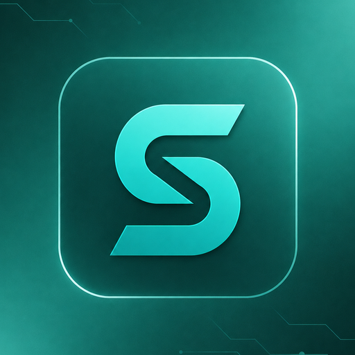

# Soclo for Claude

A marketing team inside your AI.



Soclo is a marketing app for small businesses and creators. This plugin connects Claude to your Soclo account so you can plan, make and publish marketing from a conversation: on-brand pictures, short videos with voiceover and music, social posts, simple web pages and ad campaigns, all built from your own Brand Kit.

## What the plugin does

- **Uses AI to make pictures, video and audio.** Soclo generates marketing images, short videos, voiceovers and music for your brand. Every paid make shows you the exact credit price first and starts only after you say yes.
- **Publishes to your connected social accounts** (for example Instagram, Facebook, TikTok, LinkedIn, YouTube, X, Pinterest, Threads, Bluesky) when you ask, and reports each post's status.
- **Runs ad campaigns** on ad accounts you have connected. Nothing spends until you confirm the budget, currency and targeting; a confirmed campaign then goes live.
- **Manages your Brand Kit, Library, Autopilot schedule, inbox replies, pages and analytics** inside your own Soclo account.

## Install

In Claude Code:

```
/plugin marketplace add https://github.com/socialiserapp-design/soclo-plugin.git
/plugin install soclo@soclo
```

Then sign in to Soclo when asked (or run `/mcp` and choose Soclo). On claude.ai you can also add the connector directly: Settings, Connectors, Add custom connector, `https://mcp.soclo.app/mcp`.

You need a Soclo account. Each person signs in through Soclo's own sign-in page with OAuth and chooses which permissions to grant; Claude never sees your password.

## What you can ask

- Make a 15-second video ad for my new menu using my Brand Kit.
- Write and schedule this week's posts for Instagram and LinkedIn.
- How did my last five posts perform?
- Turn this product photo into three ad pictures.

## Credits and approval

Soclo uses credits from your Soclo wallet. Planning, storyboards and quotes are free. Claude shows the exact credits for a make and spends nothing until you approve that quote. If something fails, Soclo refunds the credits for that item. If you are short of credits, top up in the Soclo app.

## What the plugin sends and stores

This plugin contains a manifest, one skill and a connection to one remote server, `https://mcp.soclo.app/mcp`, run by Soclo. It runs no local code. Requests you make through it are sent to that server and handled under Soclo's privacy policy. Your content stays in your Soclo account until you delete it.

## Help

- Setup guide: https://soclo.app/mcp
- Support: https://soclo.app/contact
- Privacy: https://soclo.app/privacy
- Terms: https://soclo.app/terms

Soclo is made by Socialiser App Ltd. The files in this repository (plugin manifest, skill and README) are MIT licensed. The Soclo service and logo are not covered by that licence.
